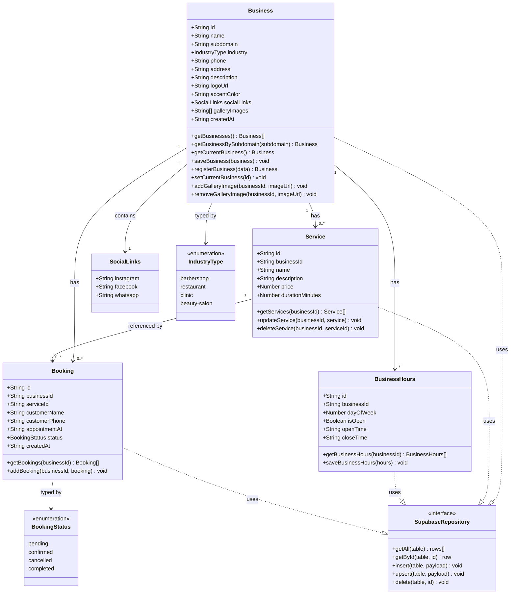

# LokalWeb — Class Diagram (UML)

**Author:** Gentian Voca  
**Project:** LokalWeb — Multi-Tenant Website-as-a-Service (WaaS)

This diagram documents all core entities in the system, their attributes, their methods (data operations), and the relationships between them. The entities map directly to TypeScript interfaces in `src/lib/types.ts` and the data operations in `src/lib/store.ts`.

---

## Class Diagram

---

## Relationships Explained

**Business → Service (1 to many)**  
One business owns zero or more services. Each service belongs to exactly one business via `businessId`. Deleting a business cascades and deletes all its services.

**Business → BusinessHours (1 to exactly 7)**  
Every business has exactly 7 business hours rows — one per day of the week (0=Sunday through 6=Saturday). These are seeded automatically on registration.

**Business → Booking (1 to many)**  
One business owns zero or more bookings. Each booking is tied to a business via `businessId`. Customers create bookings; business owners manage them through the dashboard.

**Service → Booking (1 to many)**  
Each booking references a specific service via `serviceId`. One service can appear in many bookings over time.

**Business → SocialLinks (1 to 1)**  
Each business contains exactly one `SocialLinks` object with instagram, facebook, and whatsapp fields. This is stored as a `jsonb` column in the `businesses` table.

**Business → IndustryType (typed by)**  
The `industry` field on `Business` is constrained to one of four values defined by the `IndustryType` enumeration.

**Booking → BookingStatus (typed by)**  
The `status` field on `Booking` is constrained to one of four values: `pending`, `confirmed`, `cancelled`, or `completed`.

**All entities → SupabaseRepository (uses)**  
All four entities interact with Supabase through a consistent set of database operations defined by the `SupabaseRepository` interface — `getAll`, `getById`, `insert`, `upsert`, and `delete`. This is the Repository Pattern: the data access logic is abstracted behind a consistent interface, so the rest of the application never deals with raw database calls.

---

## Notes on Implementation

- All entities are defined as TypeScript `interface` types in `src/lib/types.ts`
- All data operations are implemented as async functions in `src/lib/store.ts`
- camelCase TypeScript fields (`businessId`, `logoUrl`) map to snake_case PostgreSQL columns (`business_id`, `logo_url`) via `toSnakeBusiness()` and `fromSnakeBusiness()` helper functions
- The `SupabaseRepository` interface represents the Repository Pattern applied to this project — each entity's CRUD operations follow the same structural contract even though they are implemented as standalone functions rather than class methods, which is idiomatic in modern TypeScript/React architecture

---

_Last updated: March 2026 — Gentian Voca, Software Engineering Year 2_
